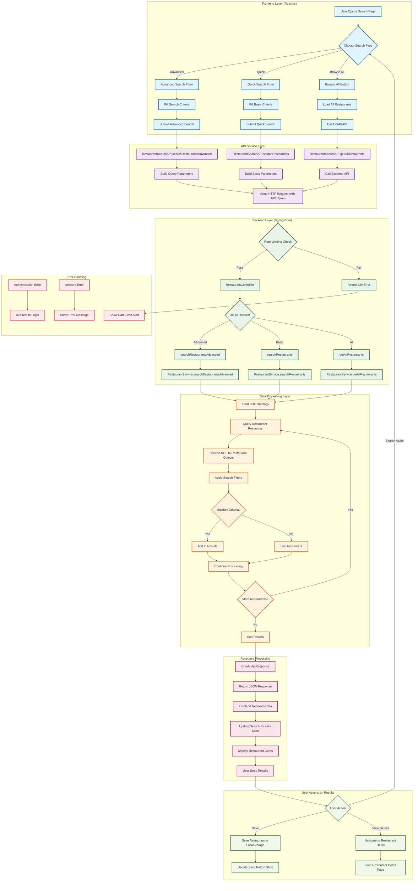
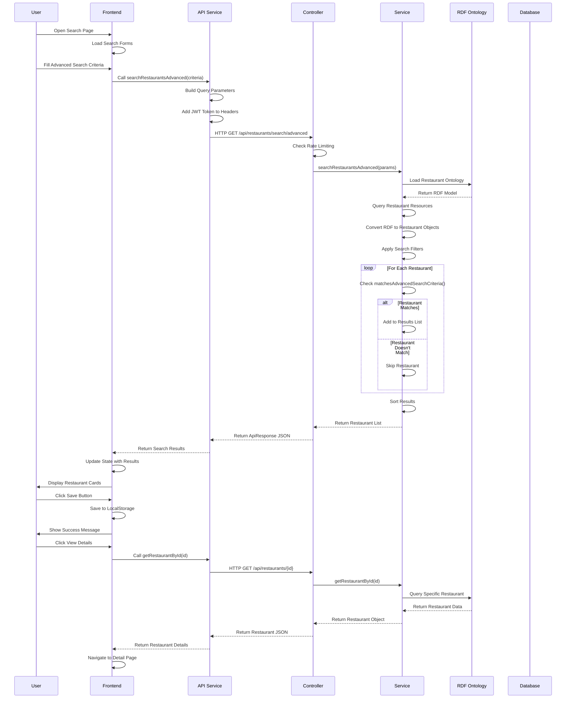
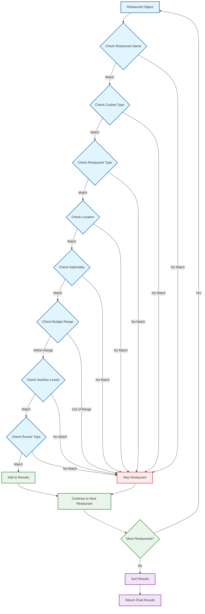
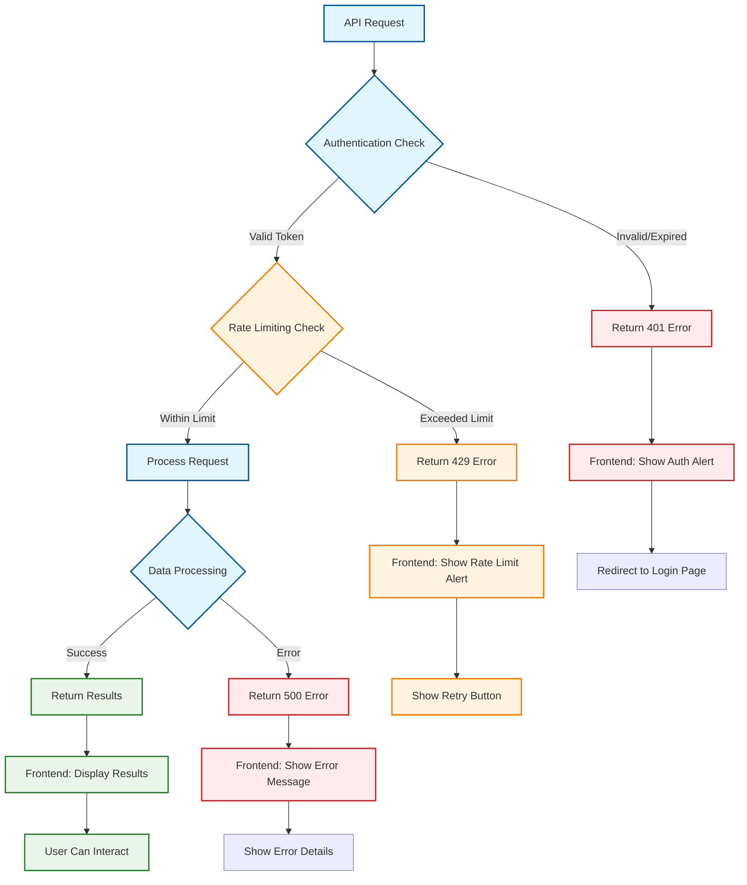
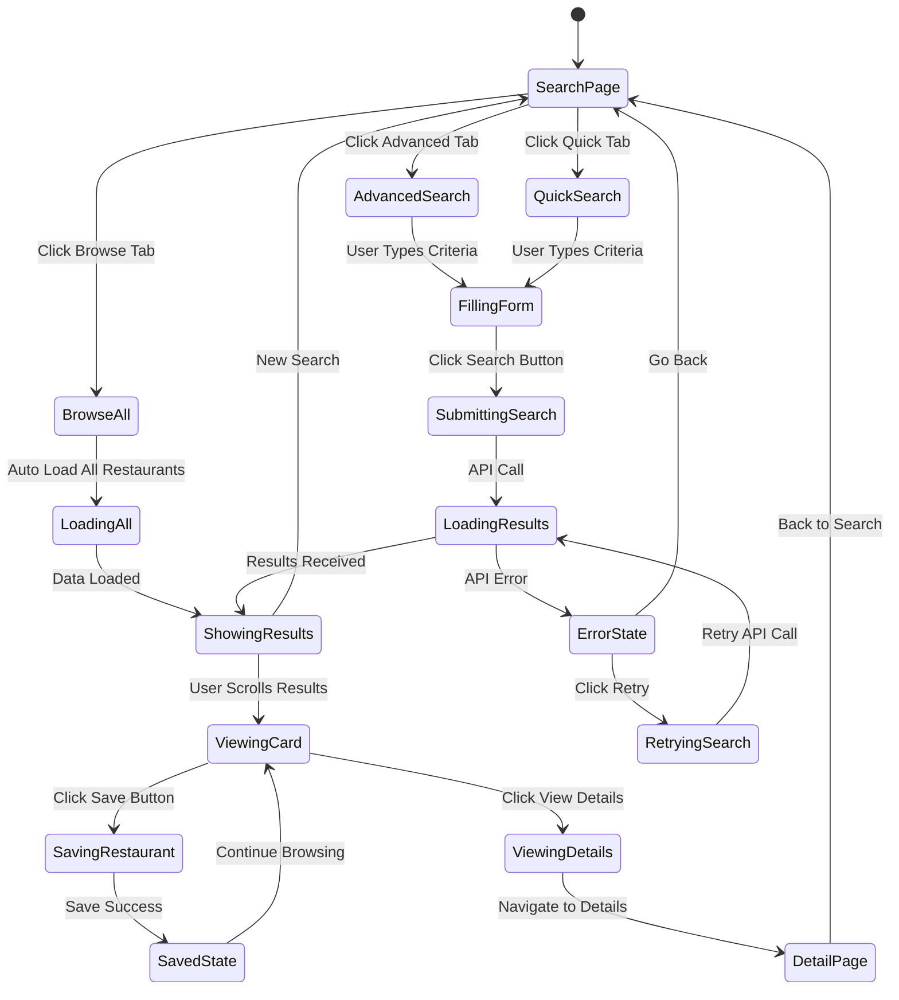
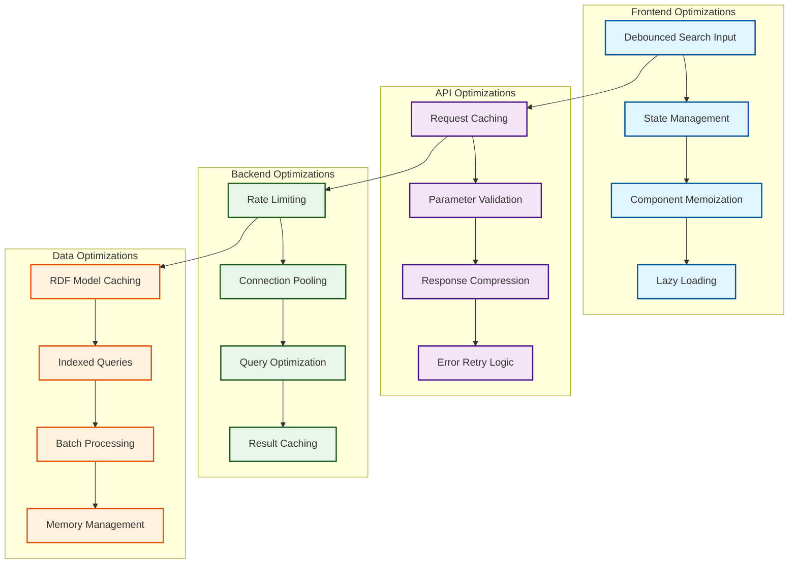
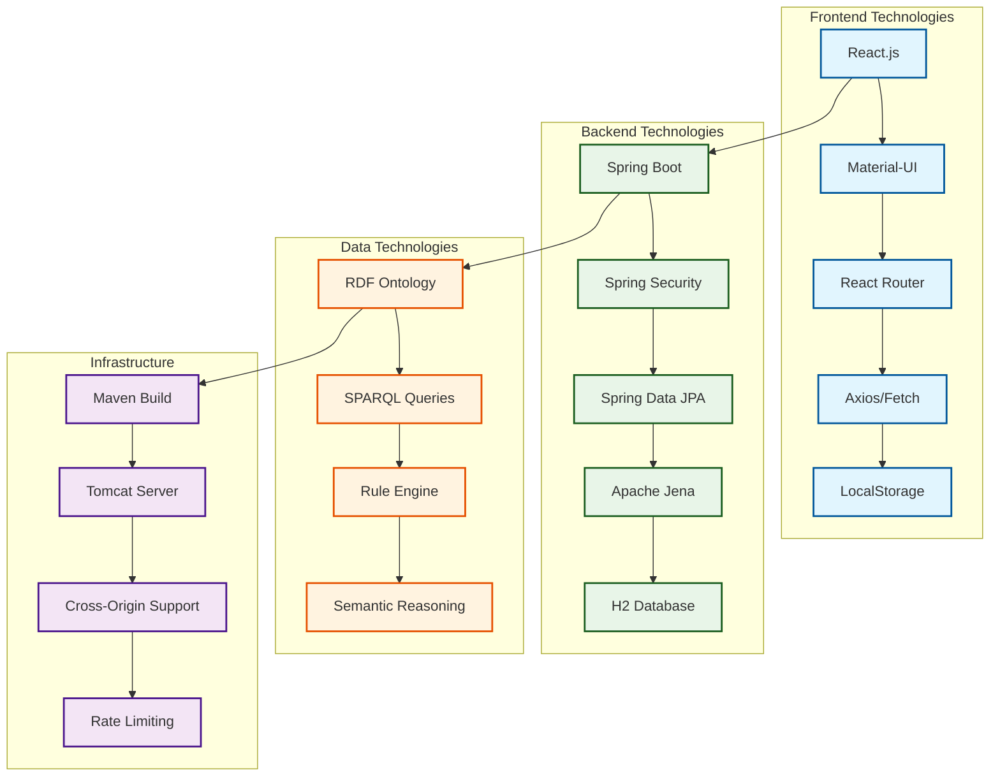

# 🔄 Restaurant Search System - Process Flow Diagram

## Complete System Architecture Flow

---

## Detailed Search Process Flow

---

## Data Flow Architecture

```mermaid
graph LR
    subgraph "Data Sources"
        A[RDF Ontology File<br/>RestaurantOntology_03_12_24.rdf]
        B[Rules File<br/>rule.rules]
        C[H2 Database<br/>Sample Data]
    end

    subgraph "Backend Processing"
        D[RestaurantService<br/>Load & Process Data]
        E[Apache Jena<br/>RDF Processing]
        F[Rule Engine<br/>Apply Business Rules]
    end

    subgraph "API Layer"
        G[RestaurantController<br/>Handle Requests]
        H[Authentication<br/>JWT Token Validation]
        I[Rate Limiting<br/>Prevent Abuse]
    end

    subgraph "Frontend Processing"
        J[RestaurantSearchAPI<br/>API Calls]
        K[Search Forms<br/>User Input]
        L[SearchResults<br/>Display Cards]
        M[UserDataService<br/>Local Storage]
    end

    subgraph "User Interface"
        N[Search Page<br/>Modern UI]
        O[Restaurant Cards<br/>Interactive Display]
        P[Save Functionality<br/>Local Persistence]
    end

    A --> D
    B --> F
    C --> D
    D --> E
    E --> F
    F --> G
    G --> H
    H --> I
    I --> J
    J --> K
    K --> L
    L --> M
    M --> N
    N --> O
    O --> P

    %% Styling
    classDef dataSource fill:#e3f2fd,stroke:#1976d2,stroke-width:2px
    classDef backend fill:#e8f5e8,stroke:#388e3c,stroke-width:2px
    classDef api fill:#fff3e0,stroke:#f57c00,stroke-width:2px
    classDef frontend fill:#fce4ec,stroke:#c2185b,stroke-width:2px
    classDef ui fill:#f3e5f5,stroke:#7b1fa2,stroke-width:2px

    class A,B,C dataSource
    class D,E,F backend
    class G,H,I api
    class J,K,L,M frontend
    class N,O,P ui
```

---

## Search Criteria Matching Flow

---

## Error Handling Flow

---

## User Interaction Flow

---

## Performance Optimization Flow

---

## Technology Stack Flow

---

**Last Updated**: December 2024  
**Version**: 1.0.0 (Complete Process Flow Diagrams)
