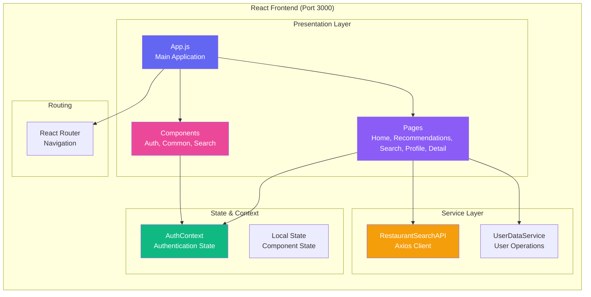
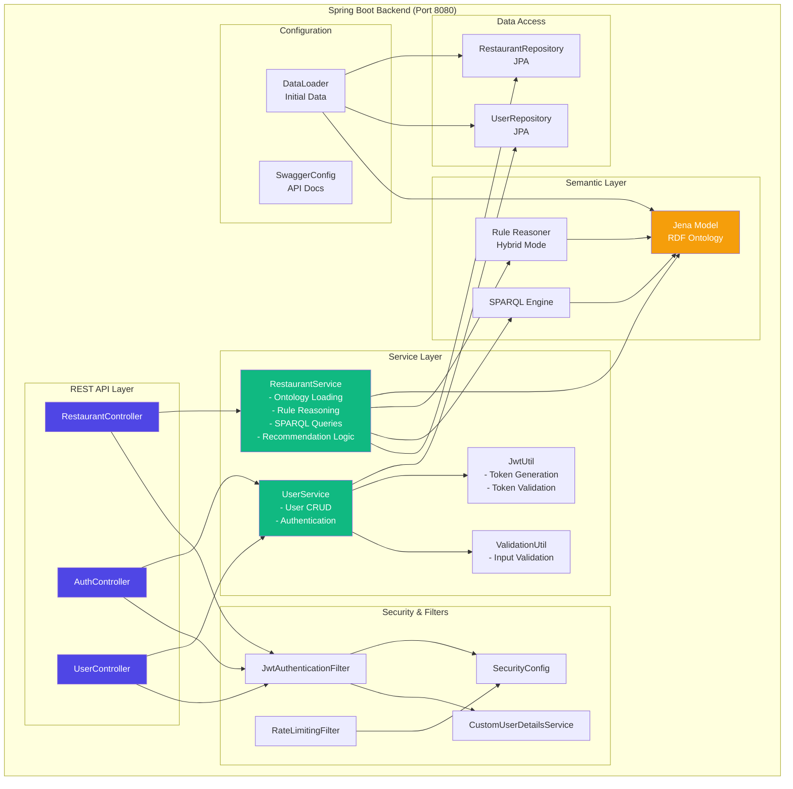
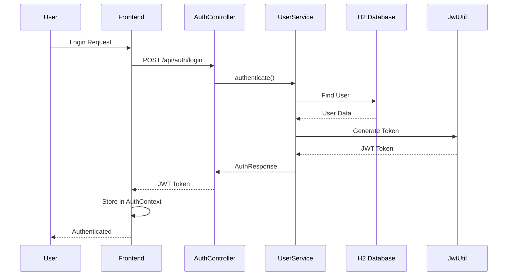
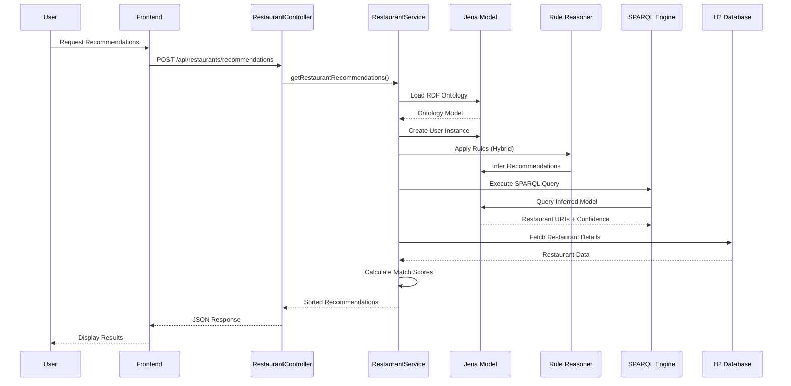
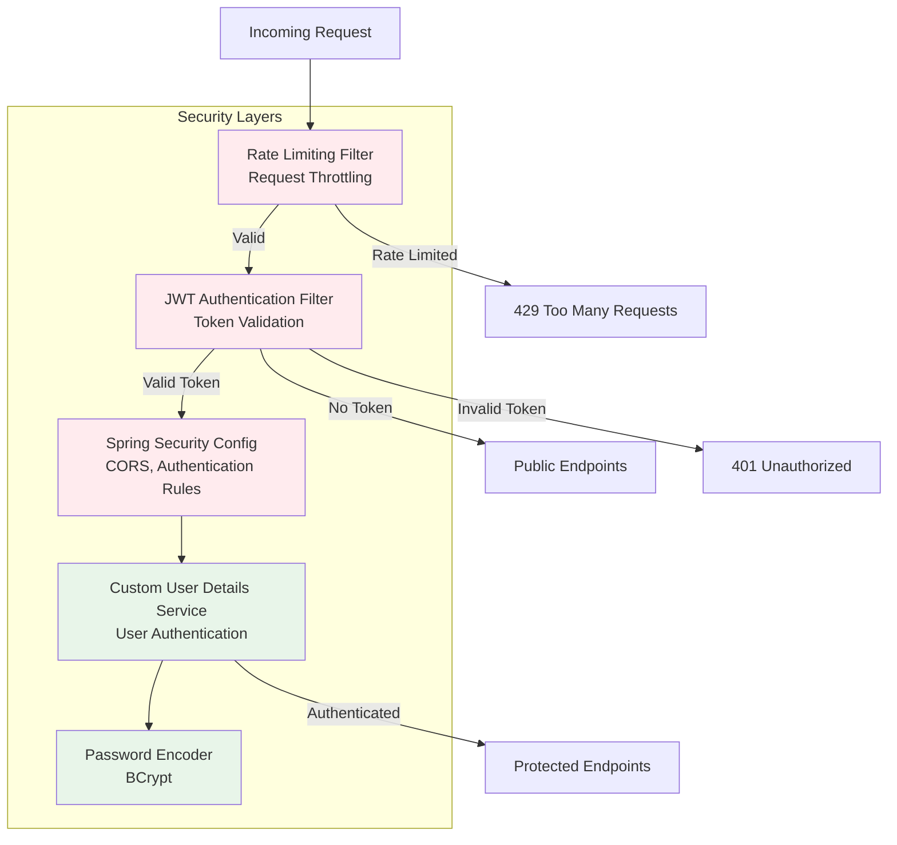
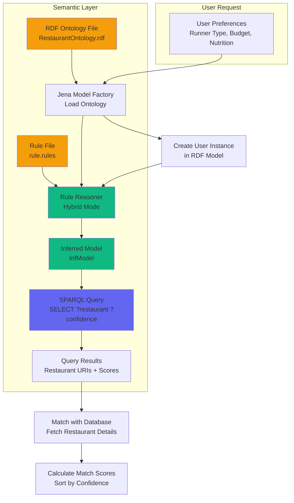
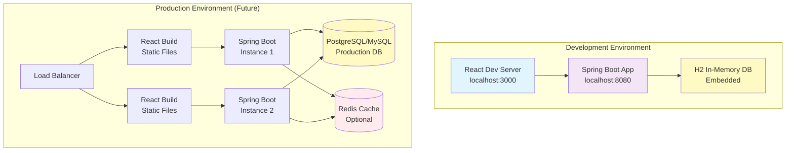
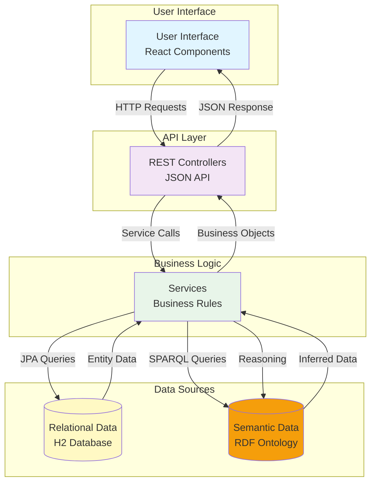

# Restaurant Recommendation System - Architecture Diagram

## System Architecture Overview

This document provides a comprehensive architecture diagram for the Restaurant Recommendation System for Runners.

## High-Level Architecture

```mermaid
graph TB
    subgraph "Client Layer"
        Browser[Web Browser]
        Mobile[Mobile Browser]
    end
    
    subgraph "Frontend Layer - React Application"
        subgraph "UI Components"
            Pages[Pages<br/>Home, Recommendations, Search, Profile]
            AuthComp[Auth Components<br/>Login, Register, ProtectedRoute]
            CommonComp[Common Components<br/>Header, Footer]
            SearchComp[Search Components<br/>QuickSearch, AdvancedSearch, Map]
        end
        
        subgraph "State Management"
            AuthContext[AuthContext<br/>JWT Token Management]
            LocalState[Local State<br/>React Hooks]
        end
        
        subgraph "Services"
            APIService[RestaurantSearchAPI<br/>Axios HTTP Client]
            UserService[UserDataService]
        end
        
        subgraph "Routing"
            Router[React Router<br/>Client-side Routing]
        end
    end
    
    subgraph "Backend Layer - Spring Boot Application"
        subgraph "API Gateway / Controllers"
            AuthController[AuthController<br/>/api/auth/*]
            RestaurantController[RestaurantController<br/>/api/restaurants/*]
            UserController[UserController<br/>/api/users/*]
        end
        
        subgraph "Security Layer"
            SecurityConfig[SecurityConfig<br/>CORS, Authentication]
            JwtFilter[JwtAuthenticationFilter<br/>Token Validation]
            RateLimitFilter[RateLimitingFilter<br/>Request Throttling]
            UserDetailsService[CustomUserDetailsService<br/>User Authentication]
        end
        
        subgraph "Business Logic / Services"
            RestaurantService[RestaurantService<br/>Recommendation Engine<br/>SPARQL Queries]
            UserService[UserService<br/>User Management]
            JwtUtil[JwtUtil<br/>Token Generation]
            ValidationUtil[ValidationUtil<br/>Input Validation]
        end
        
        subgraph "Semantic Reasoning"
            JenaModel[Apache Jena Model<br/>RDF Ontology Loading]
            Reasoner[Rule Reasoner<br/>Hybrid Reasoning]
            SPARQL[SPARQL Query Engine<br/>Recommendation Queries]
        end
        
        subgraph "Data Access Layer"
            RestaurantRepo[RestaurantRepository<br/>JPA Repository]
            UserRepo[UserRepository<br/>JPA Repository]
        end
        
        subgraph "Configuration"
            DataLoader[DataLoader<br/>Sample Data]
            SwaggerConfig[SwaggerConfig<br/>API Documentation]
            WebConfig[WebServiceConfig<br/>CORS Configuration]
        end
    end
    
    subgraph "Data Layer"
        H2DB[(H2 In-Memory Database<br/>Users, Restaurants)]
        RDFOntology[(RDF Ontology File<br/>RestaurantOntology.rdf)]
        RulesFile[(Rule File<br/>rule.rules)]
    end
    
    subgraph "External Services"
        SwaggerUI[Swagger UI<br/>API Documentation]
        H2Console[H2 Console<br/>Database Management]
    end
    
    Browser --> Pages
    Mobile --> Pages
    Pages --> Router
    Router --> AuthComp
    Router --> CommonComp
    Router --> SearchComp
    
    AuthComp --> AuthContext
    Pages --> AuthContext
    Pages --> APIService
    Pages --> UserService
    APIService --> AuthContext
    
    APIService -->|HTTP/REST| AuthController
    APIService -->|HTTP/REST| RestaurantController
    APIService -->|HTTP/REST| UserController
    
    AuthController --> JwtFilter
    RestaurantController --> JwtFilter
    UserController --> JwtFilter
    
    JwtFilter --> SecurityConfig
    RateLimitFilter --> SecurityConfig
    JwtFilter --> UserDetailsService
    
    AuthController --> UserService
    AuthController --> JwtUtil
    
    RestaurantController --> RestaurantService
    UserController --> UserService
    
    RestaurantService --> JenaModel
    RestaurantService --> Reasoner
    RestaurantService --> SPARQL
    RestaurantService --> RestaurantRepo
    
    UserService --> UserRepo
    UserService --> ValidationUtil
    
    JenaModel --> RDFOntology
    Reasoner --> RulesFile
    SPARQL --> JenaModel
    
    RestaurantRepo --> H2DB
    UserRepo --> H2DB
    
    DataLoader --> H2DB
    DataLoader --> RDFOntology
    
    SwaggerConfig --> SwaggerUI
    H2DB --> H2Console
    
    style Browser fill:#e1f5ff
    style Mobile fill:#e1f5ff
    style Pages fill:#fff4e6
    style AuthContext fill:#fff4e6
    style APIService fill:#fff4e6
    style AuthController fill:#f3e5f5
    style RestaurantController fill:#f3e5f5
    style UserController fill:#f3e5f5
    style SecurityConfig fill:#ffebee
    style JwtFilter fill:#ffebee
    style RestaurantService fill:#e8f5e9
    style UserService fill:#e8f5e9
    style JenaModel fill:#e8f5e9
    style H2DB fill:#fff9c4
    style RDFOntology fill:#fff9c4
```



## Detailed Component Architecture

### Frontend Architecture



### Backend Architecture



## Data Flow Architecture

### Authentication Flow



### Recommendation Flow



## Technology Stack

### Frontend Stack
- **React 19.1.1** - UI Library
- **Material-UI 7.3.1** - Component Library
- **React Router 7.8.2** - Routing
- **React Hook Form 7.62.0** - Form Management
- **Axios 1.11.0** - HTTP Client
- **Yup 1.7.0** - Schema Validation
- **React Leaflet** - Map Integration

### Backend Stack
- **Spring Boot 3.4.4** - Framework
- **Spring Security** - Authentication & Authorization
- **Spring Data JPA** - Data Persistence
- **H2 Database** - In-Memory Database
- **Apache Jena 4.3.2** - Semantic Web & RDF
- **JWT (jjwt 0.11.5)** - Token Authentication
- **Swagger/OpenAPI** - API Documentation

## Security Architecture



## API Endpoints Architecture

```mermaid
graph LR
    subgraph "Public Endpoints"
        P1[GET /api/restaurants/all]
        P2[GET /api/restaurants/search]
        P3[GET /api/restaurants/{id}]
        P4[POST /api/auth/register]
        P5[POST /api/auth/login]
    end
    
    subgraph "Protected Endpoints"
        PR1[POST /api/restaurants/recommendations]
        PR2[GET /api/restaurants/search/advanced]
        PR3[GET /api/users]
        PR4[GET /api/users/{id}]
        PR5[PUT /api/users/{id}]
    end
    
    subgraph "Admin Endpoints"
        A1[DELETE /api/users/{id}]
        A2[POST /api/users]
    end
    
    P1 --> JWT[JWT Filter]
    P2 --> JWT
    P3 --> JWT
    P4 --> JWT
    P5 --> JWT
    
    PR1 --> JWT
    PR2 --> JWT
    PR3 --> JWT
    PR4 --> JWT
    PR5 --> JWT
    
    A1 --> JWT
    A2 --> JWT
    
    JWT -->|Valid| Allow[Allow Request]
    JWT -->|Invalid| Deny[Deny Request]
    
    style P1 fill:#e8f5e9
    style P2 fill:#e8f5e9
    style P3 fill:#e8f5e9
    style PR1 fill:#fff9c4
    style PR2 fill:#fff9c4
    style A1 fill:#ffebee
```

## Semantic Reasoning Architecture



## Deployment Architecture



## Component Interaction Diagram



## Key Architectural Patterns

1. **Layered Architecture**: Clear separation between Presentation, Business Logic, and Data layers
2. **RESTful API**: Stateless REST endpoints for frontend-backend communication
3. **Semantic Web**: RDF ontology for intelligent reasoning and recommendations
4. **Security First**: JWT-based authentication with rate limiting
5. **Component-Based Frontend**: Modular React components with context-based state management
6. **Service-Oriented Backend**: Service layer encapsulates business logic
7. **Repository Pattern**: Data access abstraction through JPA repositories

## Performance Considerations

- **Caching**: Ontology model caching in RestaurantService
- **Rate Limiting**: API protection against abuse
- **Lazy Loading**: Frontend code splitting
- **Database Indexing**: JPA automatic indexing
- **SPARQL Optimization**: Efficient query patterns

## Scalability Considerations

- **Stateless Backend**: JWT tokens enable horizontal scaling
- **In-Memory Database**: H2 suitable for development, production needs PostgreSQL/MySQL
- **Semantic Reasoning**: Can be optimized with caching strategies
- **Frontend CDN**: Static assets can be served via CDN
- **API Gateway**: Can add API gateway for production deployment

